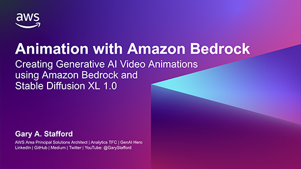
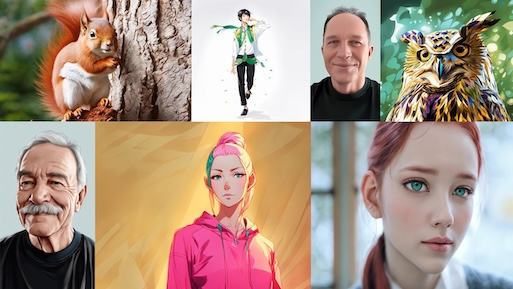
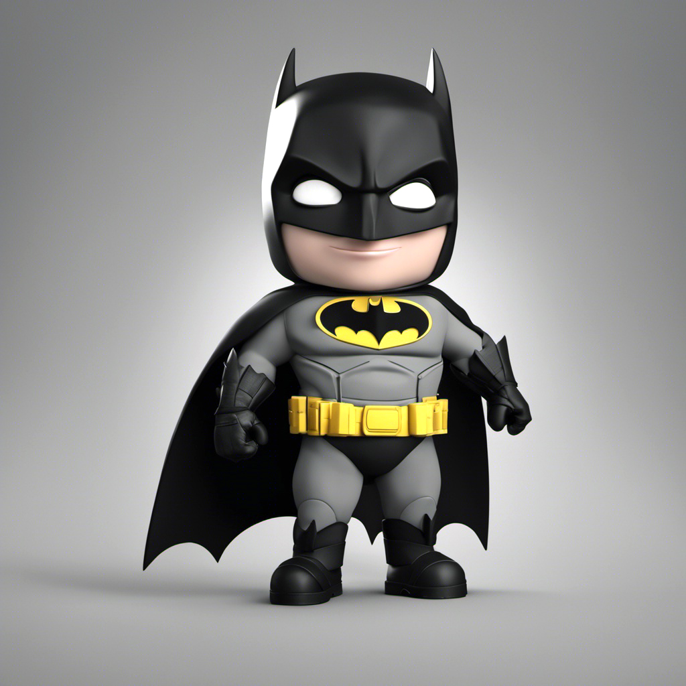
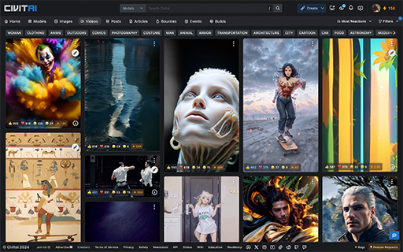
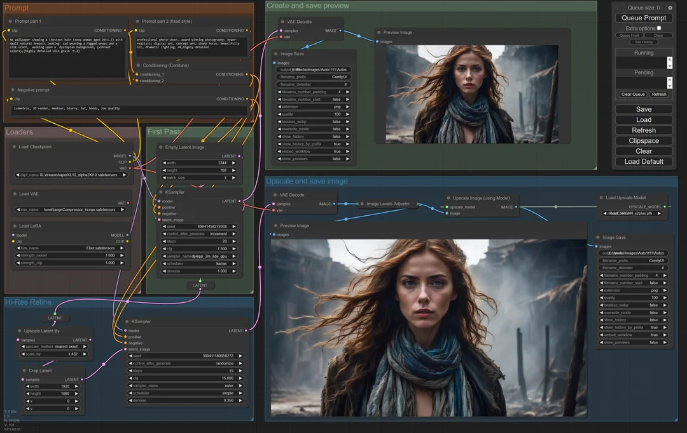
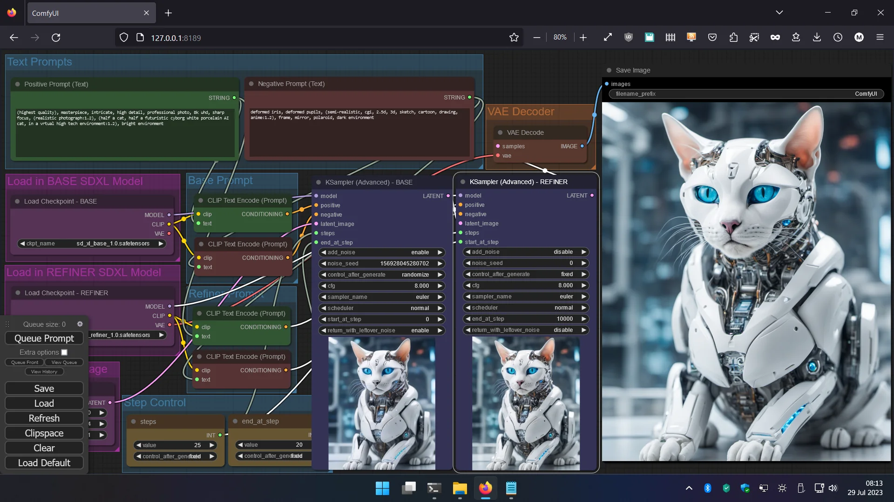

# Amazon Bedrock and Stability.ai Stable Diffusion XL 1.0 Video Animation Demo

In this 3-part demonstration we will learn how to use the AWS SDK for Python (Boto3) to create Generative AI images and simple video animations using [Amazon Bedrock](https://aws.amazon.com/bedrock/) and [Stability.ai](https://stability.ai/stable-image) Stable Diffusion XL 1.0 model.

## Demonstration

1. Text-to-image
2. Image-to-image
3. Video-to-video (video-frame-frame-video)

All instructions for this project can be found in the [Jupyter Notebook](./bedrock_image_generation_demo.ipynb) and on the accompanying [YouTube](https://youtu.be/94irLcJA9eA?si=po_xj-EHkbl_lfD2) video.

There is second video containing several sample animations available on [YouTube](https://youtu.be/_FC3a1h2JYY?si=AMo_t5tXyx5RB1Q7).

## Technologies

- **Amazon Bedrock**: Amazon Bedrock is a fully managed service that offers a choice of high-performing foundation models (FMs) from leading AI companies like AI21 Labs, Anthropic, Cohere, Meta, Mistral AI, Stability AI, and Amazon via a single API
- **Stable Diffusion XL Model**: Stable Diffusion XL or SDXL is the latest image generation model that is tailored towards more photorealistic outputs with more detailed imagery and composition compared to previous SD models, including SD 2.1. Stable Diffusion XL is a significant advancement in image generation capabilities, offering enhanced image composition and face generation that results in stunning visuals and realistic aesthetics.

## References

- [Amazon Bedrock SDXL 1.0 Documentation](https://docs.aws.amazon.com/bedrock/latest/userguide/model-parameters-diffusion-1-0-image-image.html)
- [Stability.ai API Documentation](https://platform.stability.ai/docs/api-reference#tag/v1generation/operation/imageToImage)

## Sample Generated Images, Frames, and Videos

- [Sample generated text-to-image images](./content/generated_images/text_to_image_samples/)
- [Sample generated image-to-image images](./content/generated_images/image_to_image_samples/)
- [Sample generated video frames](./content/generated_frames/generated_frame_samples/)
- [Sample generated animated GIFs](./content/generated_videos/animated_gif_samples/)

### Part 1: Text-to-Images Samples

<table border="0px solid #FFFFFFF" cellspacing="10" cellpadding="10">
    <tr>
        <td>
            
        </td>
        <td>
            
        </td>
    </tr>
    <tr>
        <td>
            
        </td>
        <td>
            
        </td>
    </tr>
    <tr>
        <td>
            
        </td>
        <td>
            
        </td>
    </tr>
</table>

### Part 2: Image-to-Images Samples

<table border="0px solid #FFFFFFF" cellspacing="10" cellpadding="10">
    <tr>
        <td>
             Original Image
        </td>
        <td>
             Variation #1
        </td>
    </tr>
    <tr>
        <td>
             Variation #2
        </td>
        <td>
             Variation #3
        </td>
    </tr>
</table>

### Part 3: Video-to-Video Samples (Animated GIFs)

Original MP4 video files, created with FFPmpeg, converted to scaled down animated GIF files.

<table border="0px solid #FFFFFFF" cellspacing="10" cellpadding="10">
    <tr>
        <td>
             Selfie Variation #1
        </td>
        <td>
             Selfie Variation #2
        </td>
    </tr>
</table>

<table border="0px solid #FFFFFFF" cellspacing="10" cellpadding="10">
    <tr>
        <td>
             Male 2 Variation #1
        </td>
        <td>
             Male 3 Variation #1
        </td>
    </tr>
</table>

<table border="0px solid #FFFFFFF" cellspacing="10" cellpadding="10">
    <tr>
        <td>
             Owl Variation #1
        </td>
    </tr>
    <!-- <tr>
        <td>
             Female 1 Variation #1
        </td>
    </tr> -->
    <tr>
        <td>
             Female 1 Variation #2
        </td>
    </tr>
    <tr>
        <td>
             Female 2 Variation #1
        </td>
    </tr>
    <tr>
        <td>
             Female 2 Variation #2
        </td>
    </tr>
    <tr>
        <td>
             Male 1 Variation #1
        </td>
    </tr>
    <tr>
        <td>
             Red Squirrel Variation #1
        </td>
    </tr>
    <tr>
        <td>
             Dancer Variation #1
        </td>
    </tr>
</table>

## State-of-the-Art Generative AI Animation

This demonstration was very basic. If you are interested in state-of-the-art Generative AI image and video generation techniques, I would suggest looking at a combination of the AnimateDiff, ControlNet, IP-Adapter, and A1111 or ComfyUI, along with the use of custom fine-tuned SDXL models. Most high-quality animations are created with multiple fine-tuned SDXL LoRAs (Low-Rank Adaptation of Large Language Models). These tools can all be used on AWS using a GPU-based [Amazon WorkSpaces](https://aws.amazon.com/pm/workspaces/) environment.

- [Automatic1111 (aka A1111) Stable Diffusion web UI](https://github.com/AUTOMATIC1111/stable-diffusion-webui)
- [ComfyUI Stable Diffusion web UI](https://github.com/comfyanonymous/ComfyUI)
- [AnimateDiff](https://animatediff.github.io/)
- [ControlNet](https://github.com/lllyasviel/ControlNet)
- [IP-Adapter](https://github.com/tencent-ailab/IP-Adapter/)
- [AnimateDiff for Stable Diffusion WebU (A1111)](https://github.com/continue-revolution/sd-webui-animatediff)
- [ControlNet for Stable Diffusion WebUI (A1111)](https://github.com/Mikubill/sd-webui-controlnet)
- [Fine-tuned Stable Diffusion XL LoRAs](https://civitai.com/models)
- [Hugging Face: LoRA the Explorer](https://huggingface.co/spaces/multimodalart/LoraTheExplorer)

If you are looking for examples of state-of-the-art Generative AI-based animations, check out [Civitai](https://civitai.com/videos). __WARNING! EXTREMELY INAPPROPRIATE CONTENT!__

<table border="0px solid #FFFFFFF" cellspacing="10" cellpadding="10">
    <tr>
        <td>
            
    </tr>
</table>

### Basic ComfyUI Workflows

These are simple examples of ComfyUI workflows from Reddit's [ComfyUI](https://www.reddit.com/r/comfyui/) and [Stable Diffusion](https://www.reddit.com/r/StableDiffusion) communities, used to create high-quality generative images. Many workflows are even more complex than the two shown below.

<table border="0px solid #FFFFFFF" cellspacing="10" cellpadding="10">
    <tr>
        <td>
             <a href="https://www.reddit.com/r/comfyui/comments/15ek9ta/comfyui_workflow_for_dreamshaper_xl/">ComfyUI Example 1</a>
    </tr>
    <tr>
        <td>
             <a href="https://www.reddit.com/r/StableDiffusion/comments/15cfiuk/tidying_up_comfyui_workflow_for_sdxl_to_fit_it_on/">ComfyUI Example 2</a>
    </tr>
</table>
